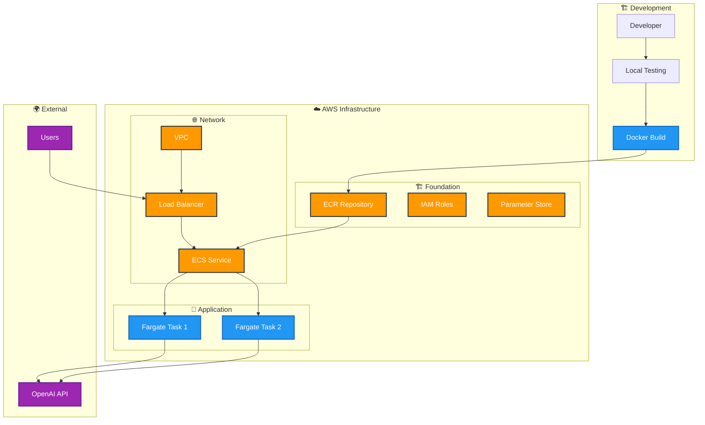

# LangGraph AWS Deployment Template

🚀 **Production-ready template for deploying LangGraph agents to AWS using ECS Fargate**

Complete infrastructure-as-code solution for deploying LangGraph-based AI agents to AWS with auto-scaling, load balancing, and secure secrets management.

## ✨ Features

- **🐳 Containerized Deployment**: Docker + ECS Fargate
- **🏗️ Infrastructure as Code**: CloudFormation templates
- **🔒 Security First**: Encrypted secrets with Parameter Store
- **📈 Auto Scaling**: CPU/memory-based scaling
- **🌐 Load Balancing**: Application Load Balancer with health checks
- **🔧 Developer Friendly**: Local development setup

## 🏛️ Architecture

```
Internet → ALB → ECS Fargate Tasks (Private Subnets) → OpenAI API
                ↓
        CloudWatch Logs & Parameter Store
```

### Deployment Architecture



## 🚀 Quick Start

### Prerequisites

- [Python 3.12+](https://www.python.org/downloads/)
- [AWS CLI v2](https://docs.aws.amazon.com/cli/latest/userguide/install-cliv2.html)
- [Docker](https://docs.docker.com/get-docker/)
- [jq](https://stedolan.github.io/jq/)
- OpenAI API key

### 1. Setup

```bash
git clone https://github.com/ajayarunachalam/langgraph-aws-deployment.git
cd langgraph-aws-deployment
cp .env.example .env
# Edit .env with your OpenAI API key
```

### 2. Local Development

```bash
# Create virtual environment
python -m venv .venv
source .venv/bin/activate

# Install dependencies
pip install -r requirements.txt

# Run locally
uvicorn app.main:app --reload --host 0.0.0.0 --port 8000
```

### 3. Deploy to AWS

```bash
# Deploy to production
./aws/scripts/deploy-langgraph.sh production us-east-1
```

### 4. Test Deployment

```bash
# Test health endpoint
curl https://your-alb-url.amazonaws.com/health

# Test chat
curl -X POST "https://your-alb-url.amazonaws.com/chat" \
  -H "Content-Type: application/json" \
  -d '{"message": "Hello!", "session_id": "test-123"}'
```

### 5. Cleanup

```bash
# Remove all AWS resources
./cleanup-aws.sh development ca-central-1
```

## 🔌 API Endpoints

| Endpoint | Method | Description |
|----------|--------|-------------|
| `/health` | GET | Health check |
| `/docs` | GET | API documentation |
| `/chat` | POST | Send message to LangGraph agent |
| `/chat/stream` | POST | Streaming chat response |
| `/agent/info` | GET | Agent metadata |

### Example Usage

```bash
# Basic chat
curl -X POST "http://localhost:8000/chat" \
  -H "Content-Type: application/json" \
  -d '{"message": "Hello!", "session_id": "user-123"}'

# Streaming chat
curl -X POST "http://localhost:8000/chat/stream" \
  -H "Content-Type: application/json" \
  -d '{"message": "Tell me a story", "session_id": "user-456"}'
```

## 📁 Project Structure

```
langgraph-aws-deployment/
├── app/                      # Application code
│   ├── main.py              # FastAPI app
│   ├── config.py            # Configuration
│   └── agent/               # LangGraph agent
├── aws/                     # AWS infrastructure
│   ├── cloudformation/      # CloudFormation templates
│   └── scripts/             # Deployment scripts
├── requirements.txt         # Python dependencies
├── Dockerfile              # Container definition
├── docker-compose.yml      # Local development
└── cleanup-aws.sh          # Cleanup script
```

## 🔧 Configuration

### Environment Variables

```bash
# Required
OPENAI_API_KEY=your_openai_api_key

# Optional
ENVIRONMENT=development
OPENAI_MODEL=gpt-4
LOG_LEVEL=INFO
```

## 🗑️ Cleanup

Remove all AWS resources when done:

```bash
./cleanup-aws.sh development ca-central-1
```

## 🛠️ Development

### Local Testing

```bash
# Run with Docker Compose
docker-compose up --build

# Test locally
curl http://localhost:8000/health
```
---

